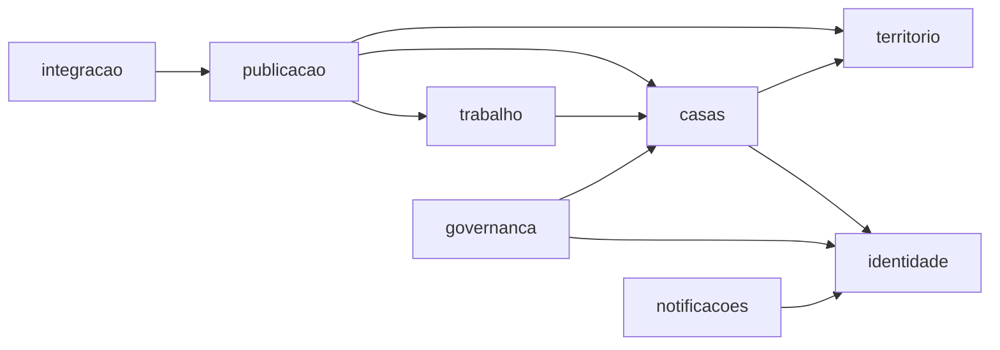
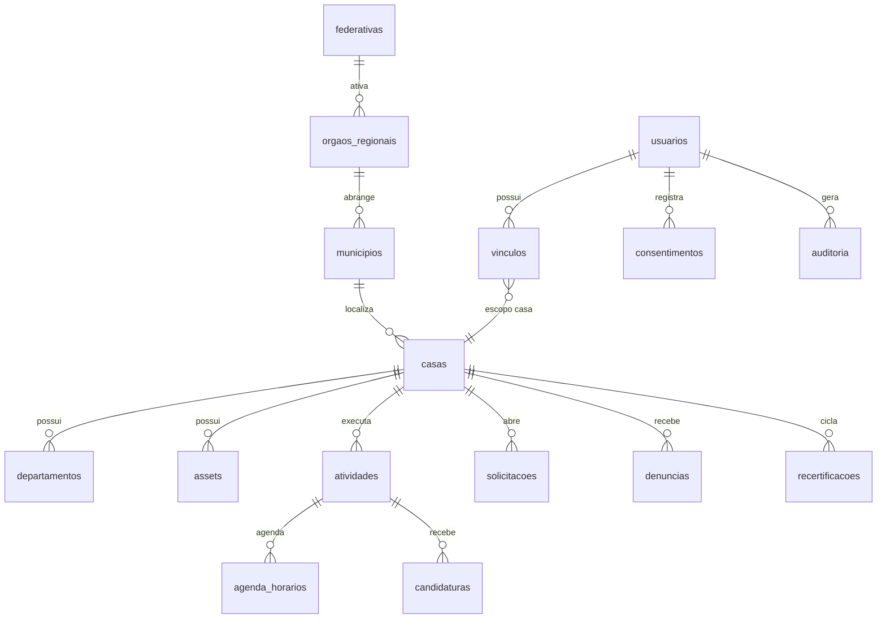

# Plano: Desenho da Arquitetura Completa — Plataforma Nacional de Casas Espíritas

> **For agentic workers:** REQUIRED SUB-SKILL: Use superpowers:subagent-driven-development (recommended) or superpowers:executing-plans to implement this plan task-by-task. Steps use checkbox (`- [ ]`) syntax for tracking.

**Objetivo:** produzir o desenho arquitetural completo do sistema (documentos em `arquitetura/`, PT-BR), do contexto C4 ao modelo físico de dados, segurança, operação e decisões arquiteturais (ADRs) — sem escrever código de aplicação.

**Arquitetura da entrega:** 5 documentos de arquitetura + pasta de ADRs, com diagramas Mermaid embutidos, lintados por markdownlint (tooling já existente). Cada decisão estrutural vira ADR e é espelhada em `spec-final/11-decisoes.md` (regra do repositório: nada de decidir em silêncio).

**Stack alvo (fixada pela spec):** PHP ≥ 8.3, MySQL 8.x, OIDC/OAuth2, Docker Compose (dev, imagens preferencialmente Alpine), CDN/WAF na borda, WordPress só como consumidor da API.

## Restrições globais

Fontes: `spec-final/10-nfr-e-operacao.md`, `06`, `04`, `07` e regras do repositório.

- Documentos em **português brasileiro**; diagramas com rótulos em PT-BR.
- Tráfego dominado por **leitura pública**; metas provisórias: páginas públicas p95 ≤ 2 s em 4G modesto, API p95 ≤ 500 ms, página ≤ 500 KB na primeira visita (`10` §10.2).
- Disponibilidade 99,5 % mensal; backup diário/30 dias; RPO 24 h; RTO 48 h (`10` §10.3).
- **Privacidade por padrão**: vínculo pessoa↔casa é dado sensível (LGPD art. 5º, II); campos `adm_*` nunca chegam à camada pública; k-anonimato (k ≥ 5) em agregados (`07`, `04` §4.4).
- **Segregação de funções**: nenhum componente pode permitir que papel federativo altere dados de casa (N.5); Revisor transita status, não edita conteúdo (`04` §4.2).
- Auditoria **imutável** de toda ação de gestão, retenção 5 anos (A13).
- Camada de **renderização separada da gestão**: o cadastro passa por compilação que produz visualizações otimizadas (`06`, introdução).
- Docker preferencialmente Alpine; processos repetíveis viram regra de Makefile; todo asset construído passa por lint.
- Este plano **não implementa** o app — produz documentos de desenho. Os commits descritos fazem parte da execução aprovada do plano.

## Estrutura de arquivos

```text
arquitetura/
  00-visao-geral.md            # objetivos, restrições, princípios, C4 contexto + contêineres
  01-modulos.md                # módulos (bounded contexts), interfaces, regras de dependência
  02-dados.md                  # modelo físico MySQL: ER, convenções, retenção, geo, auditoria
  03-seguranca-identidade.md   # OIDC/OAuth2, RBAC no código, LGPD by design, segredos
  04-operacao.md               # ambientes, compose dev, jobs, cache, backup/DR, observabilidade
  adr/
    000-modelo.md              # template de ADR
    001-monolito-modular.md
    002-framework-php.md
    003-fila-de-trabalhos.md
    004-provedor-oidc.md
    005-estrategia-de-busca.md
Makefile                       # lint-spec passa a cobrir arquitetura/
```

## Decisões arquiteturais propostas (viram ADRs na Tarefa 6)

| ADR | Proposta (recomendação) | Alternativas a documentar |
| :--- | :--- | :--- |
| 001 | **Monólito modular** PHP com módulos de fronteira explícita; extração futura só se métrica exigir | microserviços; serverless |
| 002 | Framework PHP — **decidir com o usuário** (gate na Tarefa 6): Slim 4 + componentes (mais próximo do "vanilla preferencial") × Symfony × Laravel | — |
| 003 | Fila de trabalhos **em tabela MySQL** (worker PHP dedicado); Redis só se o volume provar necessidade | Redis + supervisor; cron puro |
| 004 | Provedor OIDC — **decidir com o usuário** (gate): servidor OAuth2/OIDC embutido (ex.: `league/oauth2-server`) × Keycloak autogerido × SaaS de identidade | — |
| 005 | Busca fase 1: **MySQL FULLTEXT + índice espacial** (SRID 4326); motor semântico/vetorial só na promoção do item 7.7 do backlog | OpenSearch desde o início |

---

### Tarefa 1: Visão geral e tooling (`00-visao-geral.md`)

**Arquivos:**

- Criar: `arquitetura/00-visao-geral.md`
- Modificar: `Makefile` (linha `lint-spec`: acrescentar `"arquitetura/*.md" "arquitetura/adr/*.md"` ao glob — sem remover nada)

**Interfaces:**

- Consome: `spec-final/01`, `06`, `10`.
- Produz: nomes canônicos dos contêineres e módulos usados por todos os documentos seguintes: `app-gestao`, `renderizador-publico`, `api-publica`, `worker-fila`, `banco-mysql`, `cdn-borda`, `provedor-identidade`.

- [ ] **Passo 1: escrever o documento** com estas seções (conteúdo, não placeholders):

1. **Objetivos e restrições** — resumo de 1 parágrafo + tabela das metas de `10` §10.2–10.3.
2. **Princípios**: (a) leitura pública barata — tudo que o visitante vê pode ser servido de cache/CDN; (b) gestão separada da publicação — escrita passa por compilação/publicação; (c) privacidade por padrão — dado sensível nunca cruza a fronteira pública; (d) monólito modular — fronteiras de módulo no código, não na rede; (e) degradação graciosa — sem JS o conteúdo público permanece íntegro.
3. **C4 nível 1 (contexto)** — diagrama Mermaid:

   ```mermaid
   flowchart TB
       visitante["Visitante<br/>(público leigo)"] --> cdn["CDN / WAF"]
       gestor["Dirigente / Coordenador /<br/>Revisor / Federativa"] --> cdn
       cdn --> plataforma["Plataforma Casas Espíritas<br/>(monólito modular PHP)"]
       wp["Sites WordPress<br/>(plugin oficial)"] -->|API pública + API key| cdn
       parceiro["Integradores<br/>(webhooks — diferido, D18)"] <-.->|eventos assinados HMAC| plataforma
       plataforma -->|Web Push - D17| gestor
       plataforma --> mysql[("MySQL 8.x")]
       plataforma --> geo["Geocodificação<br/>(provedor P4)"]
       plataforma --> zap["SMS/WhatsApp<br/>(provedor P3)"]
       plataforma --> vlibras["VLibras (gov.br)"]
   ```

4. **C4 nível 2 (contêineres)** — diagrama Mermaid:

   ```mermaid
   flowchart TB
       subgraph borda [Borda]
           cdn["CDN + WAF + cache de páginas públicas"]
       end
       subgraph app [Aplicação PHP - monólito modular]
           rp["renderizador-publico<br/>páginas públicas, JSON-LD, sitemap, PWA"]
           api["api-publica<br/>OpenAPI v1 (plans/build-api.md)"]
           ag["app-gestao<br/>painéis autenticados (casa, órgão, federativa, revisor)"]
           idp["provedor-identidade<br/>OIDC/OAuth2 (ADR-004)"]
       end
       wk["worker-fila<br/>jobs assíncronos (ADR-003)"]
       mysql[("banco-mysql<br/>dados + fila + auditoria")]
       borda --> app
       rp --> mysql
       api --> mysql
       ag --> mysql
       idp --> mysql
       wk --> mysql
       ag -. enfileira .-> wk
   ```

5. **Fluxo de publicação** (princípio b): gravação no `app-gestao` → validação → evento de domínio → `worker-fila` recompila projeções públicas (contagens, sumários, sitemap, páginas cacheáveis) → invalidação de cache na CDN. Pré-visualização antes de publicar usa o mesmo renderizador com flag de rascunho.
6. **O que este desenho não cobre** (remete ao backlog): MCP (7.8), busca vetorial (7.7), WebSocket (7.9) — cada um ganhará anexo quando promovido.

- [ ] **Passo 2: atualizar o `Makefile`** (glob do `lint-spec`) e rodar `make lint-spec`
Esperado: `Summary: 0 error(s)`.

- [ ] **Passo 3: commit**

```bash
git add arquitetura/00-visao-geral.md Makefile
git commit -m "docs(arquitetura): visão geral (C4 contexto e contêineres)"
```

---

### Tarefa 2: Módulos e fronteiras (`01-modulos.md`)

**Arquivos:**

- Criar: `arquitetura/01-modulos.md`

**Interfaces:**

- Consome: nomes de contêineres da Tarefa 1; entidades de `spec-final/02`.
- Produz: lista canônica de módulos (usada em `02-dados.md` para agrupar tabelas e em `03` para mapear permissões): `identidade`, `territorio`, `casas`, `trabalho`, `governanca`, `publicacao`, `integracao`, `notificacoes`.

- [ ] **Passo 1: escrever o documento** com uma seção por módulo, cada uma respondendo três perguntas — o que faz, como é usado (interface), de que depende:

| Módulo | Responsabilidade | Entidades (de `02`) | Depende de |
| :--- | :--- | :--- | :--- |
| `identidade` | contas, verificação de telefone, vínculos papel×escopo, sessões OIDC | Usuário, Vínculo, Consentimento | territorio (escopos) |
| `territorio` | base IBGE, federativas, órgãos regionais, resolução de jurisdição | Município, Federativa, ÓrgãoRegional | — |
| `casas` | cadastro da casa, departamentos, assets, temas, feature toggles, ciclo de vida | Casa, Departamento, Asset | territorio, identidade |
| `trabalho` | atividades, eventos, palestras, agendas, cálculo "aberta agora", candidaturas | Atividade, Evento, Palestra, Candidatura | casas |
| `governanca` | revisão (SLA 15d), recertificação, disputas, denúncias, solicitações, auditoria imutável | Solicitação, Denúncia, Recertificação, Auditoria | casas, identidade |
| `publicacao` | projeções públicas, JSON-LD, sitemap, redirecionamentos 301, PWA, minimização de dados | (somente leitura das demais) | todas (leitura) |
| `integracao` | API v1, API keys, quotas, plugin WP como consumidor; webhooks (assinatura/retentativa) **diferidos — D18** | InscricaoWebhook (diferida) | publicacao, governanca |
| `notificacoes` | **Web Push (VAPID) como canal primário — D17**, e-mail + painel garantidos, WhatsApp/SMS por federativa (A11); payload de push sem dado pessoal | InscricaoPush | identidade, governanca |

- [ ] **Passo 2: regras de dependência** (diagrama + texto):



Regras textuais: (1) dependências só no sentido das setas — ciclo é defeito de desenho; (2) `publicacao` e `integracao` **nunca** leem tabelas com dado pessoal (`adm_*`, candidaturas, vínculos) — consomem apenas projeções públicas; (3) comunicação entre módulos por interfaces PHP explícitas (contratos), nunca por consulta direta à tabela alheia; (4) eventos de domínio (síncronos no monólito, enfileirados quando disparam trabalho pesado) são o mecanismo de reação entre módulos.

- [ ] **Passo 3: mapear os épicos do backlog aos módulos** (tabela épico → módulo responsável) para provar cobertura: épicos 1–2 → `casas`/`identidade`; 3 → `trabalho`; 4 → `publicacao`; 5 → `territorio`/`governanca`; 6 → `governanca`; 7 → `integracao`/`publicacao`; 8–9 → anexos futuros.

- [ ] **Passo 4: rodar `make lint-spec`** — esperado: 0 errors.

- [ ] **Passo 5: commit**

```bash
git add arquitetura/01-modulos.md
git commit -m "docs(arquitetura): módulos, fronteiras e regras de dependência"
```

---

### Tarefa 3: Modelo físico de dados (`02-dados.md`)

**Arquivos:**

- Criar: `arquitetura/02-dados.md`

**Interfaces:**

- Consome: módulos da Tarefa 2; entidades e taxonomia de `spec-final/02`; retenções de `07` (A13).
- Produz: nomes de tabelas e convenções usados por qualquer plano de implementação futuro.

- [ ] **Passo 1: convenções** (escrever como lista normativa):

- Tabelas em `snake_case` plural PT-BR (`casas`, `atividades`, `vinculos`); PK `id` BINARY(16) (UUID v7 — ordenável por tempo); `criado_em`/`atualizado_em` em todas.
- Charset `utf8mb4`; collation `utf8mb4_0900_ai_ci`.
- Colunas públicas × administrativas na **mesma tabela** `casas`, com prefixo `adm_` e visão SQL `casas_publicas` que as exclui — a camada `publicacao` só enxerga a visão (defesa em profundidade).
- Geo: coluna `localizacao POINT SRID 4326 NULL` + índice `SPATIAL`; busca por raio via `ST_Distance_Sphere`.
- Sem exclusão física de dados com retenção legal: `candidaturas` são **anonimizadas** (job aos 6 meses), `auditoria` é append-only.
- Multi-tenancy lógico: toda tabela de conteúdo carrega `casa_id` (ou `orgao_id`/`federativa_uf`); não há schema por tenant.

- [ ] **Passo 2: diagrama ER (Mermaid)** cobrindo o núcleo:



Complementar com a lista das tabelas de suporte: `classificacoes_casa` (N:N casa×termo), `areas_atividade` (N:N atividade×sigla), `fechamentos_excepcionais`, `temas`, `feature_toggles`, `api_keys`, `push_inscricoes` (endpoint + chaves p256dh/auth por dispositivo — D17), `preferencias_notificacao`, `webhook_inscricoes` e `webhook_entregas` (diferidas com o item 7.3 — D18), `fila_trabalhos` (ADR-003), `redirecionamentos` (301 de slugs antigos — D13).

- [ ] **Passo 3: tabela de retenção** (mapear A13 e `07` a colunas/jobs):

| Dado | Regra | Mecanismo |
| :--- | :--- | :--- |
| Candidaturas | anonimizar 6 meses após decisão | job diário (`worker-fila`) |
| Documentos de disputa | desfecho + 90 dias | job diário |
| Auditoria | 5 anos, imutável | partição por ano + purga anual |
| Consentimentos | vínculo + 5 anos | job anual |
| Contas 16–17 | visibilidade restrita, exclusão prioritária | flag `menor` + fluxo `07` §7.5 |

- [ ] **Passo 4: rodar `make lint-spec`** — esperado: 0 errors.

- [ ] **Passo 5: commit**

```bash
git add arquitetura/02-dados.md
git commit -m "docs(arquitetura): modelo físico de dados, convenções e retenção"
```

---

### Tarefa 4: Segurança e identidade (`03-seguranca-identidade.md`)

**Arquivos:**

- Criar: `arquitetura/03-seguranca-identidade.md`

**Interfaces:**

- Consome: `spec-final/04` (papéis/matriz), `07` (LGPD), `09` (ameaças); escopos OAuth2 de `plans/build-api.md` (`casa.gerenciar`, `revisao.status`, `orgao.gerenciar`, `federativa.gerenciar`).
- Produz: modelo de autorização em código referenciado pela implementação.

- [ ] **Passo 1: escrever o documento** com estas seções:

1. **Autenticação**: fluxo OIDC authorization code + PKCE; verificação de telefone (SMS/WhatsApp, P3) na criação de conta; sessão web via cookie `HttpOnly/SameSite=Lax`; tokens de API só para a API v1. Provedor: remeter ao ADR-004.
2. **Autorização (RBAC em código)**: função central única `autorizar(usuario, acao, recurso)` que resolve vínculos papel×escopo (matriz de `04` §4.2 transcrita em tabela de política, não espalhada em `if`s); escopos OAuth2 limitam o token, o vínculo decide; **testes de política** listados como requisito (um caso por célula da matriz).
3. **Salvaguardas estruturais** (defesa em profundidade, cada uma com o mecanismo): N.5 — nenhuma rota de escrita de casa aceita vínculo federativo; Revisor — endpoint separado só de status; dado sensível — visão `casas_publicas` + revisão de toda query da camada `publicacao`; candidaturas — checagem dupla (rota + política).
4. **LGPD by design**: minimização por projeção; consentimento imutável; direitos do titular (exportação JSON, correção, exclusão — fluxo `07` §7.6); criptografia em repouso para colunas `adm_*` e contatos pessoais; logs sem dado pessoal.
5. **Segredos e dependências**: segredos por variável de ambiente/secret store (nunca no código, `10` §10.4); atualização monitorada de dependências; imagem base Alpine com varredura.
6. **Modelo de ameaças**: referenciar `spec-final/09` e mapear cada mitigação a um componente desta arquitetura (tabela ameaça → componente → controle).

- [ ] **Passo 2: rodar `make lint-spec`** — esperado: 0 errors.

- [ ] **Passo 3: commit**

```bash
git add arquitetura/03-seguranca-identidade.md
git commit -m "docs(arquitetura): segurança, identidade e LGPD by design"
```

---

### Tarefa 5: Operação (`04-operacao.md`)

**Arquivos:**

- Criar: `arquitetura/04-operacao.md`

**Interfaces:**

- Consome: `10` §10.3–10.7; contêineres da Tarefa 1.
- Produz: topologia de desenvolvimento (compose) e de produção de referência.

- [ ] **Passo 1: escrever o documento** com estas seções:

1. **Ambientes** (`10` §10.7): dev = Docker Compose local; homologação = réplica reduzida com dados sintéticos (nunca dados pessoais reais); produção = requisitos mínimos de §10.3/§10.4.
2. **Topologia de desenvolvimento** (especificação do compose — o arquivo será criado na implementação):

   | Serviço | Imagem | Papel |
   | :--- | :--- | :--- |
   | `web` | `nginx:alpine` | proxy + estáticos |
   | `app` | `php:8.3-fpm-alpine` + extensões (pdo_mysql, intl, gd) | monólito |
   | `worker` | mesma imagem do `app`, comando da fila | jobs assíncronos |
   | `mysql` | `mysql:8.x` (oficial; sem variante Alpine — exceção registrada) | dados |
   | `mailpit` | `axllent/mailpit` (Alpine) | e-mail de dev |

3. **Cache em camadas**: CDN (páginas públicas + assets, invalidação por evento de publicação) → cache de aplicação (consolidações/contagens recalculadas em background) → MySQL. Regra: TTL curto + invalidação ativa; nada de cache de dado autenticado na borda.
4. **Jobs de background** (lista fechada de `10` §10.5 com gatilho e periodicidade em tabela): geocodificação (evento), vínculos território↔órgãos (evento), consolidações (evento + horário), lembretes de recertificação (diário), anonimização de candidaturas (diário), entrega de notificações push com fallback para e-mail quando a inscrição expirou (evento — D17), entrega de webhooks com retentativa/backoff (evento — diferido, D18), sitemap (diário + evento).
5. **Backup/DR**: dump lógico diário + retenção 30 dias; teste de restauração trimestral documentado; RPO 24 h / RTO 48 h; runbook de recuperação passo a passo.
6. **Observabilidade**: logs centralizados estruturados (sem PII); métricas dos KPIs técnicos; alertas obrigatórios de `10` §10.4 (fila de revisão acima do SLA, pico de cadastro/bot, falha de webhook, 5xx).

- [ ] **Passo 2: rodar `make lint-spec`** — esperado: 0 errors.

- [ ] **Passo 3: commit**

```bash
git add arquitetura/04-operacao.md
git commit -m "docs(arquitetura): ambientes, jobs, cache, DR e observabilidade"
```

---

### Tarefa 6: ADRs (com gates de decisão)

**Arquivos:**

- Criar: `arquitetura/adr/000-modelo.md`
- Criar: `arquitetura/adr/001-monolito-modular.md`
- Criar: `arquitetura/adr/002-framework-php.md`
- Criar: `arquitetura/adr/003-fila-de-trabalhos.md`
- Criar: `arquitetura/adr/004-provedor-oidc.md`
- Criar: `arquitetura/adr/005-estrategia-de-busca.md`

**Interfaces:**

- Consome: documentos das Tarefas 1–5.
- Produz: decisões numeradas, espelhadas em `spec-final/11-decisoes.md` (Tarefa 7).

- [ ] **Passo 1: criar o template `000-modelo.md`**

```markdown
# ADR NNN: Título

- **Status:** proposto | aceito | substituído por ADR-XXX
- **Data:** AAAA-MM-DD
- **Decisão espelhada em:** spec-final/11-decisoes.md (D__)

## Contexto

[Forças em jogo, restrições da spec, o que muda com a escolha.]

## Decisão

[A escolha, em uma frase afirmativa.]

## Alternativas consideradas

[Cada alternativa com o motivo objetivo da recusa.]

## Consequências

[O que fica mais fácil, o que fica mais difícil, gatilho de revisão.]
```

- [ ] **Passo 2: escrever ADR-001, ADR-003 e ADR-005** (recomendações firmes deste plano — conteúdo conforme a tabela "Decisões arquiteturais propostas", com contexto extraído das restrições globais; status `aceito`).

- [ ] **Passo 3 (gate): perguntar ao usuário** antes de escrever ADR-002 e ADR-004, uma pergunta por vez:

1. Framework PHP: **Slim 4 + componentes** (aderente ao "CSS puro/JS progressivo" e ao controle fino de segurança; mais trabalho manual) × **Symfony** (componentes maduros, curva maior) × **Laravel** (produtividade e ecossistema; mais "mágica" e peso). Sem recomendação imposta — apresentar trade-offs e registrar a escolha.
2. Provedor OIDC: **embutido** (`league/oauth2-server`; um serviço a menos, aderente ao monólito) × **Keycloak** (completo, mas serviço Java pesado para operadora voluntária) × **SaaS** (terceiro com implicação LGPD — exigiria novos passos de configuração e registro como operador em `07`).

Escrever os dois ADRs com a resposta (status `aceito`); se o usuário adiar, status `proposto` com prazo e dono — e registrar pendência em `11`.

- [ ] **Passo 4: rodar `make lint-spec`** — esperado: 0 errors.

- [ ] **Passo 5: commit**

```bash
git add arquitetura/adr
git commit -m "docs(arquitetura): ADRs 001-005 (monólito, framework, fila, OIDC, busca)"
```

---

### Tarefa 7: Integração no repositório e auto-revisão

**Arquivos:**

- Modificar: `spec-final/11-decisoes.md` (decisões espelhadas + pendências novas)
- Modificar: `spec-final/10-nfr-e-operacao.md` (§10.1: referência a `arquitetura/`)
- Modificar: `README.md` (estrutura: pasta `arquitetura/`)
- Modificar: `GEMINI.md` (Directory Structure: `arquitetura/`; resolver parcialmente o TODO "Define PHP/MySQL environment setup" apontando para `arquitetura/04-operacao.md`)

**Interfaces:**

- Consome: tudo das Tarefas 1–6.
- Produz: rastreabilidade completa.

- [ ] **Passo 1: espelhar decisões em `11-decisoes.md`** — uma linha por ADR aceito (numeração D = próxima disponível no momento da execução; D17/D18 já registram notificações push e webhooks diferidos), coluna "Onde está especificado" apontando para o ADR.

- [ ] **Passo 2: atualizar `10` §10.1, `README.md` e `GEMINI.md`** (referências curtas; não duplicar conteúdo).

- [ ] **Passo 3: auto-revisão** (checklist objetivo):

1. Cada módulo de `01-modulos.md` responde: o que faz, como é usado, de que depende.
2. Nenhum fluxo público toca tabela com dado pessoal — conferir §2 de `01` e a visão `casas_publicas` em `02`.
3. Todo épico `fazer agora` do backlog tem módulo responsável (tabela da Tarefa 2 Passo 3).
4. Metas numéricas citadas conferem com `10` (não inventar números novos).
5. Grep por placeholders: `grep -rn "TBD\|TODO\|\[preencher\]" arquitetura/` → zero.
6. `make lint-spec` sem erros.

- [ ] **Passo 4: commit final**

```bash
git add arquitetura spec-final/10-nfr-e-operacao.md spec-final/11-decisoes.md README.md GEMINI.md
git commit -m "docs(arquitetura): integra desenho arquitetural ao repositório"
```

---

## Verificação global do plano

- Entrega é **desenho**, não código: nenhum arquivo `.php`, `compose.yaml` ou SQL executável é criado — apenas suas especificações.
- Fora do escopo: arquitetura do MCP (7.8), busca vetorial (7.7), WebSocket (7.9) e plugin WordPress (tem contrato próprio em `06` §6.5; arquitetura interna do plugin será plano separado quando promovido).
- Critério de pronto: 5 documentos + 6 ADRs lintados; decisões espelhadas em `11`; gates de ADR-002/004 resolvidos ou registrados como pendência com dono.
