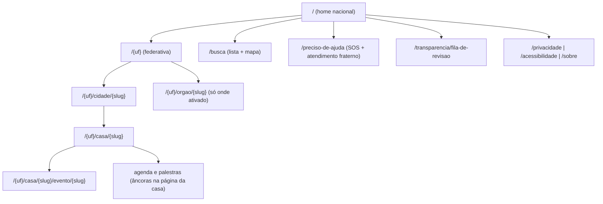

# Plano: Desenho do Frontend — Plataforma Nacional de Casas Espíritas

> **For agentic workers:** REQUIRED SUB-SKILL: Use superpowers:subagent-driven-development (recommended) or superpowers:executing-plans to implement this plan task-by-task. Steps use checkbox (`- [ ]`) syntax for tracking.

**Objetivo:** produzir o desenho completo do frontend (documentos em `frontend/`, PT-BR) — fundamentos técnicos, arquitetura de informação, design system aplicado, especificação página a página (público e gestão), acessibilidade, PWA/offline — mais protótipos HTML estáticos dos 3 templates de maior risco.

**Arquitetura da entrega:** frontend **renderizado no servidor** pelo módulo `publicacao` (ver `plans/build-architecture.md`), com HTML5 semântico, CSS puro (tokens + `@layer`) e JavaScript progressivo — sem framework JS. O mapa e os widgets dinâmicos consomem a própria API v1 (`plans/build-api.md`). Documentos lintados por markdownlint; protótipos lintados por htmlhint (Docker).

**Stack:** HTML5, CSS puro (custom properties, cascade layers), JS vanilla em módulos ES, Leaflet (mapa — ver gate), fontes Manrope + Public Sans **auto-hospedadas**, service worker para PWA.

> **⚠️ Bloqueio antes da Tarefa 1 — pendência P11 (`spec-final/11-decisoes.md`):**
> este plano assume a decisão atual de stack (HTML renderizado no servidor, sem
> framework JS). Um protótipo funcional em `local/mvp-local/` (React + TypeScript +
> Vite + Dexie/IndexedDB) foi encontrado no repositório e o usuário pediu revisão
> dessa decisão à luz dele. **Não iniciar a Tarefa 1 sem antes resolver P11** — se a
> revisão trocar a stack para SPA/React, as seções que dependem de renderização no
> servidor (princípio "sem JS o conteúdo permanece íntegro", orçamentos de
> desempenho, PWA offline sem escrita) precisam ser reescritas antes de prosseguir.

## Restrições globais

Fontes: `spec-final/08-acessibilidade-ux.md`, `10` §10.2, `06`, `docs/design/DESIGN.md`, regras do repositório.

- Documentos em **português brasileiro**; interface 100% PT-BR, linguagem simples (público leigo — `01` §1.5), vocabulário inclusivo e não propagandista (`08` §8.3).
- **WCAG 2.1 AA é requisito de aceitação** em toda página (pública e de gestão); AAA onde viável (`08` §8.1). Não é seção de um documento: é critério transversal de todas as tarefas.
- HTML semântico estrito; ARIA só onde o HTML nativo não basta; navegação integral por teclado; foco visível; alvos de toque ≥ 44×44 px.
- **Sem JS o conteúdo público permanece íntegro** (`08` §8.4) — JS só melhora, nunca condiciona.
- Orçamento de desempenho (`10` §10.2, provisório): página pública ≤ 500 KB na primeira visita (sem mapa), p95 ≤ 2 s em 4G modesto.
- **Nenhum recurso de terceiros em runtime** (fontes, CSS, JS de CDN externa) — implicação LGPD e de resiliência; únicas exceções: VLibras (gov.br, revisão P8) e tiles do mapa (pendência a registrar).
- Textos de ajuda explicitam a **visibilidade pública de cada campo** nos formulários (`08` §8.3).
- Temas de casa vêm de **galeria curada com contraste AA bloqueante** (A10); todo elemento de tema degrada sem JS.
- Números SOS (CVV 188, FEB Escuta, SOS Prece) **sempre disponíveis offline** (`08` §8.6).
- Docker preferencialmente Alpine; processos repetíveis viram regra de Makefile; todo asset construído passa por lint. Commits fazem parte da execução aprovada do plano.

## Estrutura de arquivos

```text
frontend/
  00-fundamentos.md               # princípios, stack CSS/JS, orçamentos, fontes, mapa
  01-arquitetura-de-informacao.md # mapa do site, rotas (D13), navegação, breadcrumbs, estados
  02-design-system.md             # tokens aplicados do DESIGN.md + catálogo de componentes
  03-paginas-publicas.md          # especificação página a página (público)
  04-paineis-de-gestao.md         # especificação por papel (casa, revisor, órgão, federativa)
  05-acessibilidade-e-testes.md   # WCAG por componente, testes manuais e de pipeline
  06-pwa-offline.md               # manifest, service worker, estratégia de cache, SOS
  prototipos/
    index.html                    # índice dos protótipos
    home-busca.html               # template 1: home com busca + mapa + marquee
    pagina-casa.html              # template 2: página pública da casa (com tema)
    painel-formulario.html        # template 3: padrão de formulário de gestão (wizard)
    css/base.css                  # tokens + camadas usados pelos protótipos
Makefile                          # + lint-html, frontend-serve; lint-spec cobre frontend/*.md
```

## Decisões de desenho embutidas neste plano

Registrá-las em `spec-final/11-decisoes.md` na Tarefa 9:

1. **Renderização no servidor** para tudo; JS progressivo por módulos ES pequenos (mapa, marquee, ajuda de formulário, service worker). Sem framework JS, sem build de JS na fase 1 (arquivos servidos como escritos).
2. **CSS puro com `@layer`** (`reset`, `tokens`, `base`, `componentes`, `tema`, `utilitarios`) e custom properties como única interface dos temas — um tema é somente um conjunto de valores de tokens, o que torna a checagem de contraste automatizável e **bloqueante** (A10).
3. **Fontes auto-hospedadas** (Manrope + Public Sans, subset latin, `font-display: swap`) — nada de Google Fonts em runtime (LGPD).
4. **Leaflet** como biblioteca de mapa (leve, sem chave, acessibilizável); carregado **sob demanda** (fora do orçamento de 500 KB da primeira visita). Provedor de tiles = pendência (gate na Tarefa 1).
5. **`prefers-reduced-motion` respeitado** em todo movimento (marquee, sliders, parallax); marquee de palestras com controles de pausa (WCAG 2.2.2).
6. **Modo de alto contraste** = tema especial da galeria, persistido em `localStorage` + atributo `data-tema-contraste` no `<html>`; funciona também via `prefers-contrast`.

---

### Tarefa 1: Fundamentos e tooling (`00-fundamentos.md`)

**Arquivos:**

- Criar: `frontend/00-fundamentos.md`
- Modificar: `Makefile` (glob do `lint-spec` passa a incluir `"frontend/*.md"`; novos alvos `lint-html` e `frontend-serve`)

**Interfaces:**

- Consome: `docs/design/DESIGN.md`, `08`, `10` §10.2.
- Produz: nomes das camadas CSS e dos módulos JS usados por todas as tarefas seguintes; alvos de make usados pela Tarefa 8.

- [ ] **Passo 1 (gate): perguntar ao usuário o provedor de tiles do mapa** — os tiles públicos do OpenStreetMap têm política de uso que **não cobre produção**; opções: provedor pago (MapTiler/Stadia etc., exige conta e chave — implica passos de configuração e registro LGPD) × servidor de tiles próprio (custo operacional) × decidir depois (registrar pendência com dono, mapa fica fora dos protótipos). Registrar o resultado na Tarefa 9.

- [ ] **Passo 2: escrever o documento** com estas seções:

1. **Princípios** (5, um parágrafo cada): conteúdo íntegro sem JS; desempenho é acessibilidade (`08` §8.7); nada de terceiro em runtime; o tema não pode quebrar a acessibilidade; o mesmo HTML serve leitor de tela, celular modesto e desktop.
2. **Arquitetura CSS**: as 6 camadas de `@layer` (ordem e responsabilidade de cada), convenção de nome de classe (`c-` componente, `u-` utilitário, `t-` token de tema), breakpoints (`36rem`, `62rem`, `80rem` — mobile-first), unidades (rem; px só para bordas).
3. **JavaScript progressivo**: módulos ES por recurso (`mapa.js`, `marquee.js`, `ajuda-formulario.js`, `sw-registro.js`, `notificacoes-push.js` — este só nos painéis de gestão); cada módulo declara seu fallback sem JS (tabela recurso → comportamento sem JS; para push, o fallback é o e-mail — A11). Dados dinâmicos vêm da API v1 (`GET /casas?bbox=…`, `GET /palestras`).
4. **Orçamento de desempenho por tipo de página** (tabela normativa, dentro do teto de `10` §10.2):

   | Tipo de página | HTML | CSS | JS | Imagens | Fontes | Total 1ª visita |
   | :--- | :--- | :--- | :--- | :--- | :--- | :--- |
   | Pública (casa, cidade, busca) | ≤ 60 KB | ≤ 60 KB | ≤ 30 KB | ≤ 200 KB | ≤ 120 KB | ≤ 500 KB |
   | Home | ≤ 60 KB | ≤ 60 KB | ≤ 50 KB | ≤ 200 KB | ≤ 120 KB | ≤ 500 KB |
   | Mapa (após opt-in de carregamento) | — | — | +150 KB (Leaflet+tiles sob demanda) | — | — | fora do teto |
   | Gestão | ≤ 80 KB | ≤ 60 KB | ≤ 60 KB | ≤ 100 KB | ≤ 120 KB | ≤ 450 KB |

5. **Fontes**: Manrope (títulos) + Public Sans (texto), subset latin, WOFF2, `font-display: swap`, fallback de sistema declarado (`font-family` completa).
6. **Imagens**: `loading="lazy"` fora da dobra, `srcset` responsivo, AVIF/WebP com fallback, `alt` obrigatório (bloqueio no formulário de upload).

- [ ] **Passo 3: acrescentar alvos ao `Makefile`** (e ampliar o glob do `lint-spec`):

```makefile
# Lint dos protótipos HTML (htmlhint via docker node alpine)
lint-html:
	docker run --rm -v $(CURDIR):/w -w /w node:alpine npx --yes htmlhint "frontend/prototipos/**/*.html"

# Visualização local dos protótipos de frontend
frontend-serve:
	cd frontend/prototipos && python3 -m http.server 8767 --bind 127.0.0.1
```

- [ ] **Passo 4: rodar `make lint-spec`** — esperado: 0 errors (o alvo `lint-html` só roda a partir da Tarefa 8, quando houver HTML).

- [ ] **Passo 5: commit**

```bash
git add frontend/00-fundamentos.md Makefile
git commit -m "docs(frontend): fundamentos, orçamentos de desempenho e tooling"
```

---

### Tarefa 2: Arquitetura de informação (`01-arquitetura-de-informacao.md`)

**Arquivos:**

- Criar: `frontend/01-arquitetura-de-informacao.md`

**Interfaces:**

- Consome: rotas de `06` §6.1 (D13), personas de `01` §1.5, ciclo de vida da casa (`02` §2.7).
- Produz: inventário canônico de páginas (IDs `PUB-*` e `GES-*`) referenciado pelas Tarefas 4, 5 e 7.

- [ ] **Passo 1: mapa do site** (Mermaid) espelhando as URLs de D13 — as rotas do frontend **são** as rotas públicas da spec, sem invenção:



- [ ] **Passo 2: inventário de páginas** — tabela com ID, rota, persona primária, objetivo em uma frase e conteúdo mínimo. Público: `PUB-01` home, `PUB-02` busca/resultados, `PUB-03` página da casa, `PUB-04` cidade, `PUB-05` órgão regional, `PUB-06` federativa, `PUB-07` evento, `PUB-08` preciso-de-ajuda (SOS), `PUB-09` fila de revisão, `PUB-10` institucionais (privacidade, acessibilidade, sobre). Gestão: `GES-01` entrar/criar conta (verificação por telefone), `GES-02` assistente de adesão da casa, `GES-03` painel da casa, `GES-04` atividades/eventos/palestras (CRUD), `GES-05` candidaturas, `GES-06` solicitações, `GES-07` recertificação, `GES-08` painel do revisor, `GES-09` painel do órgão, `GES-10` painel da federativa, `GES-11` minha conta/privacidade (direitos LGPD).
- [ ] **Passo 3: navegação e orientação**: cabeçalho global (busca sempre visível, "Preciso de ajuda" com destaque permanente, entrar); breadcrumbs renderizam **apenas níveis existentes** (D13 — ex.: DF sem intermediários); rodapé com SOS, acessibilidade, privacidade; navegação do painel por papel (o menu mostra só o que o vínculo permite — RBAC de `04`).
- [ ] **Passo 4: estados obrigatórios por página**: vazio (ex.: cidade sem casas → convite "recomende uma casa"), erro, carregando (só onde há JS), offline (banner + dado possivelmente desatualizado), casa não ativa (A8: nome + cidade + status, `noindex`).
- [ ] **Passo 5: rodar `make lint-spec`** — esperado: 0 errors; **commit**

```bash
git add frontend/01-arquitetura-de-informacao.md
git commit -m "docs(frontend): arquitetura de informação e inventário de páginas"
```

---

### Tarefa 3: Design system aplicado (`02-design-system.md`)

**Arquivos:**

- Criar: `frontend/02-design-system.md`

**Interfaces:**

- Consome: `docs/design/DESIGN.md` ("Ethereal Professional") — **referenciar, não duplicar**; regras de `08` prevalecem sobre estética (`08` §8.5).
- Produz: catálogo de componentes com nomes canônicos (`c-*`) usados nas Tarefas 4, 5 e 8.

- [ ] **Passo 1: tokens** — tabela dos custom properties (`--cor-*`, `--tipo-*`, `--espaco-*`, `--raio-*`, `--sombra-*`) com valor-base vindo do DESIGN.md e a regra: temas só podem sobrescrever tokens da camada `tema`, e toda dupla texto/fundo declarada precisa passar de 4,5:1 (AA) — verificação bloqueante na publicação do tema (A10).
- [ ] **Passo 2: catálogo de componentes** — um bloco por componente com: anatomia (HTML semântico de referência), estados, teclado/foco, ARIA (se necessário) e critério WCAG associado. Lista fechada da fase 1:

| Componente | Nota essencial |
| :--- | :--- |
| `c-botao` | variantes primário/secundário/perigo; área ≥ 44 px |
| `c-campo` | label sempre visível, ajuda contextual, **selo de visibilidade** ("público" / "só administradores" — `08` §8.3), erro por `aria-describedby` |
| `c-cartao-casa` | resultado de busca: nome, cidade, classificações, "aberta agora" com aviso |
| `c-selo-status` | ativa/pendente/em disputa/desatualizada — nunca só por cor |
| `c-agenda` | tabela de horários acessível (`<caption>`, `scope`); variantes semanal/lista |
| `c-marquee-palestras` | pausável (WCAG 2.2.2), vira lista estática sem JS ou com `prefers-reduced-motion` |
| `c-mapa` | opt-in de carregamento ("Ver mapa"), alternativa em lista sempre presente |
| `c-assistente` | wizard passo a passo: 1 assunto por tela, progresso, salvar rascunho |
| `c-tabela-dados` | painéis: ordenável, com resumo textual |
| `c-paginacao` | espelha `pagina`/`por_pagina` da API |
| `c-alerta` | info/sucesso/atenção/erro; `role="status"` ou `role="alert"` |
| `c-banner-offline` | indica conteúdo possivelmente desatualizado (`08` §8.6) |
| `c-breadcrumb` | só níveis existentes; `nav[aria-label="Você está em"]` |
| `c-botao-sos` | fixo no rodapé de páginas públicas; funciona offline |
| `c-seletor-tema` | galeria curada com prévia e selo "contraste garantido" |
| `c-toggle-contraste` | alto contraste persistente |

- [ ] **Passo 3: padrões de formulário** (transversal aos painéis): rótulos claros sem jargão; um assunto por etapa; erros no topo + no campo; nunca perder dado digitado; autosave de rascunho em formulários longos; telefone como identificador primário (e-mail opcional — A12).
- [ ] **Passo 4: rodar `make lint-spec`** — esperado: 0 errors; **commit**

```bash
git add frontend/02-design-system.md
git commit -m "docs(frontend): tokens e catálogo de componentes"
```

---

### Tarefa 4: Páginas públicas (`03-paginas-publicas.md`)

**Arquivos:**

- Criar: `frontend/03-paginas-publicas.md`

**Interfaces:**

- Consome: inventário `PUB-*` (Tarefa 2), componentes `c-*` (Tarefa 3), JSON-LD de `06` §6.2.
- Produz: especificação de referência dos protótipos da Tarefa 8.

- [ ] **Passo 1: especificar cada página `PUB-*`** com: objetivo, wireframe textual (blocos em ordem de leitura — que é a ordem do DOM), componentes usados, dados (endpoint da API v1 ou projeção server-side), JSON-LD emitido, estados. Exemplar completo do formato (repetir para todas):

```text
PUB-03 — Página da casa (/{uf}/casa/{slug})
Objetivo: visitante decide se e quando visitar; encontra endereço, horários e contato.
Ordem do DOM (= ordem de leitura):
  1. breadcrumb (só níveis existentes)
  2. h1 nome da casa + selo de status + "aberta agora" com aviso "confirme por telefone"
  3. reuniões públicas (destaque — regra de 02 §2.1.1: fonte única, perfil ou Atividade)
  4. como chegar: endereço, botão "ver no mapa" (opt-in), telefone/WhatsApp clicáveis
  5. agenda de atividades públicas (c-agenda) + exportar .ics
  6. próximos eventos e palestras
  7. sobre a casa (bio, redes sociais)
  8. órgão regional a que pertence (link)
  9. reportar erro neste perfil (leva ao formulário de denúncia)
Dados: projeção server-side de CasaPublica; JSON-LD: NGO + BreadcrumbList.
Tema: aplica tokens do tema da casa (camada `tema`); alto contraste sobrepõe.
Estados: casa inativa (aviso, sem agenda); casa não ativa → variante A8 (nome+cidade+status, noindex).
```

- [ ] **Passo 2: regras especiais por página**: `PUB-01` home — busca é o elemento central (h1 + formulário GET simples que funciona sem JS), marquee de palestras pausável, carrossel (item 4.4, `avaliar bem`) fica **fora** da fase 1; `PUB-02` busca — formulário GET com filtros como `<details>`, lista primeiro e mapa como aprimoramento, paginação server-side; `PUB-08` preciso-de-ajuda — página mais leve do site (sem imagens), números SOS como links `tel:`, atendimento fraterno "aberto agora" por proximidade, pré-cacheada pelo service worker (Tarefa 7), N.2: **nenhum registro de quem acessa**; `PUB-09` fila de revisão — tabela simples nome+cidade+status (A8).
- [ ] **Passo 3: rodar `make lint-spec`** — esperado: 0 errors; **commit**

```bash
git add frontend/03-paginas-publicas.md
git commit -m "docs(frontend): especificação das páginas públicas"
```

---

### Tarefa 5: Painéis de gestão (`04-paineis-de-gestao.md`)

**Arquivos:**

- Criar: `frontend/04-paineis-de-gestao.md`

**Interfaces:**

- Consome: inventário `GES-*`, componentes `c-*`, fluxos de `05-fluxos-operacionais.md`, matriz RBAC de `04`.
- Produz: especificação dos fluxos autenticados; padrão de formulário prototipado na Tarefa 8.

- [ ] **Passo 1: especificar cada página `GES-*`** no mesmo formato da Tarefa 4. Pontos que a especificação deve resolver explicitamente (não deixar genérico):

1. **`GES-02` assistente de adesão** — persona: dirigente com pouca habilidade técnica (item 1.1). Etapas: (1) nome e cidade; (2) física ou virtual (+ endereço se física); (3) contato do administrador (nome + telefone; e-mail opcional); (4) classificações de atividades (caixas de seleção — só informam, `02` §2.1.1); (5) reuniões públicas (dias/horários); (6) revisão e envio. Cada etapa salva rascunho; linguagem sem jargão; selo de visibilidade em cada campo; ao enviar: explicação clara do que acontece ("um revisor da sua região vai analisar em até 15 dias").
2. **`GES-08` painel do revisor** — fila da jurisdição ordenada por idade (SLA 15 dias com indicador de risco), diff legível de alterações críticas (`05` §5.3), ações **somente de status** (aprovar / rejeitar / devolver / disputa) com justificativa obrigatória (mín. 10 caracteres), histórico de anotações. Sem botão de edição de conteúdo — a UI reflete a regra, não só o backend.
3. **`GES-05` candidaturas** — visível só a coordenador da atividade + admin (D8); aviso de privacidade fixo no topo ("dados sensíveis — não repasse"); contagem regressiva de anonimização após decisão.
4. **`GES-07` recertificação** — um clique para "confirmar que está tudo certo" + atalho para corrigir; aviso do selo de desatualização.
5. **`GES-11` minha conta** — direitos LGPD self-service: exportar (JSON), corrigir, excluir; texto do prazo (15 dias — A3).
6. **Dashboards regionais (`GES-09`/`GES-10`)** — somente agregados (k ≥ 5); célula suprimida mostra "< 5" e nunca o valor real; sem lista de pessoas em nenhuma visão regional (`04` §4.4).

- [ ] **Passo 2: rodar `make lint-spec`** — esperado: 0 errors; **commit**

```bash
git add frontend/04-paineis-de-gestao.md
git commit -m "docs(frontend): especificação dos painéis de gestão"
```

---

### Tarefa 6: Acessibilidade e plano de testes (`05-acessibilidade-e-testes.md`)

**Arquivos:**

- Criar: `frontend/05-acessibilidade-e-testes.md`

**Interfaces:**

- Consome: `08` na íntegra; componentes da Tarefa 3.
- Produz: critérios de aceitação verificáveis para a implementação e para o pipeline.

- [ ] **Passo 1: escrever o documento** com estas seções:

1. **Matriz componente × critério WCAG** — para cada `c-*` da Tarefa 3, os critérios aplicáveis (nº do critério + como verificar). Ex.: `c-marquee-palestras` → 2.2.2 (pausar/parar), 2.3.3 (reduced motion); `c-campo` → 1.3.1, 3.3.2, 4.1.2.
2. **Recursos assistivos** (`08` §8.2), cada um com especificação de implementação: VLibras (script gov.br em páginas públicas; carregamento adiado; nota de privacidade pendente P8); alto contraste (tema + `prefers-contrast`); zoom 200% sem quebra (testar nos 3 protótipos); tipografia amigável a dislexia (entrelinha ≥ 1,5, parágrafos curtos, sem justificado).
3. **Testes automatizados no pipeline de implementação** (especificação, não execução): axe-core sobre as rotas canônicas em CI, falha = bloqueio de merge; validação HTML (Nu checker); orçamento de desempenho verificado com Lighthouse CI contra a tabela da Tarefa 1.
4. **Roteiro de verificação manual periódica** (`08` §8.1): passos concretos com NVDA (Windows) e VoiceOver (iOS) para 3 jornadas — achar uma casa aberta agora; cadastrar uma casa por telefone; revisar uma adesão. Cada roteiro: passo → resultado esperado.
5. **Conteúdo**: checklist de linguagem simples para textos de interface (frases curtas, voz ativa, siglas espíritas naturais, siglas técnicas explicadas).

- [ ] **Passo 2: rodar `make lint-spec`** — esperado: 0 errors; **commit**

```bash
git add frontend/05-acessibilidade-e-testes.md
git commit -m "docs(frontend): matriz WCAG e plano de testes de acessibilidade"
```

---

### Tarefa 7: PWA e offline (`06-pwa-offline.md`)

**Arquivos:**

- Criar: `frontend/06-pwa-offline.md`

**Interfaces:**

- Consome: `08` §8.6 (D15), páginas `PUB-*` da Tarefa 2.
- Produz: especificação do service worker e do manifest para a implementação.

- [ ] **Passo 1: escrever o documento**:

1. **Manifest**: nome, ícones (maskable), `display: minimal-ui`, tema conforme tokens.
2. **Estratégias de cache por rota** (tabela normativa):

   | Rota | Estratégia | Justificativa |
   | :--- | :--- | :--- |
   | `/preciso-de-ajuda` + números SOS | **precache na instalação** | D15 — sempre offline |
   | CSS/JS/fontes | precache versionado | shell estável |
   | Páginas públicas visitadas | stale-while-revalidate | leitura offline do que o usuário já viu |
   | Busca e API | network-only com fallback de aviso | dado dinâmico |
   | Gestão (`/gestao/**`) | **network-only, nunca cacheada** | sem escrita offline (D15) + dado pessoal fora do cache |

3. **Indicador de desatualização**: toda página servida do cache exibe `c-banner-offline` com a data da cópia ("Você está offline — dados de {data}. Confirme por telefone antes de se deslocar.").
4. **Atualização do SW**: skip-waiting com aviso discreto ("conteúdo atualizado — recarregar"); versionamento do precache por hash.
5. **Limites**: teto de cache (ex.: 50 páginas, LRU); limpeza ao sair da conta; nada de dado autenticado ou pessoal em cache.
6. **Notificações push (D17 — item 7.10)**, só para papéis de gestão:
   - **Opt-in contextual**: a permissão é pedida no painel, no momento em que faz sentido ("Quer ser avisado na hora quando chegar uma adesão?") — **nunca** no carregamento da página; recusa é respeitada sem re-pergunta automática.
   - **Payload sem dado pessoal**: o push transita pelos serviços de push dos navegadores (terceiros) — o payload carrega só tipo de evento + id opaco; ao receber, o service worker busca o conteúdo na API autenticada e monta a notificação localmente.
   - **Registro**: `notificacoes-push.js` assina via `PushManager` (chave VAPID pública) e registra em `POST /gestao/notificacoes/push` (plano da API); expiração da inscrição rebaixa o canal para e-mail (A11) e avisa no painel.
   - **Handlers do SW**: `push` (montar notificação) e `notificationclick` (abrir a tela certa do painel); clique nunca expõe conteúdo sem sessão válida.
   - **Preferências**: tela em `GES-11` para escolher eventos (adesões, candidaturas, denúncias, solicitações) por canal.

- [ ] **Passo 2: rodar `make lint-spec`** — esperado: 0 errors; **commit**

```bash
git add frontend/06-pwa-offline.md
git commit -m "docs(frontend): especificação PWA e estratégia offline"
```

---

### Tarefa 8: Protótipos HTML dos 3 templates de maior risco

**Arquivos:**

- Criar: `frontend/prototipos/index.html`
- Criar: `frontend/prototipos/css/base.css`
- Criar: `frontend/prototipos/home-busca.html`
- Criar: `frontend/prototipos/pagina-casa.html`
- Criar: `frontend/prototipos/painel-formulario.html`

**Interfaces:**

- Consome: especificações das Tarefas 3–5 (os protótipos **seguem** o documento; divergência = corrigir o protótipo ou revisar o documento, nunca ignorar).
- Produz: HTML de referência navegável via `make frontend-serve` (porta 8767).

Regras dos protótipos: HTML + CSS puros, **zero JavaScript** (prova da degradação graciosa); dados fictícios plausíveis (casas de MG, sem dados reais de pessoas); `css/base.css` implementa as camadas e tokens da Tarefa 3; cada página passa no `lint-html` e na leitura por ordem de DOM.

- [ ] **Passo 1: escrever `css/base.css`** — camadas `reset`, `tokens` (valores do DESIGN.md), `base`, `componentes` (somente os `c-*` usados nos 3 templates), `tema` (um tema exemplo), `utilitarios`; incluir bloco `@media (prefers-contrast: more)` e `@media (prefers-reduced-motion: reduce)`.
- [ ] **Passo 2: escrever os 3 templates + índice**, seguindo à risca a ordem de DOM das especificações (`PUB-01`, `PUB-03`, padrão `c-assistente` de `GES-02`, etapa 3 — contato do administrador, com selos de visibilidade).
- [ ] **Passo 3: rodar `make lint-html`** — esperado: **Scanned 4 files, no errors found**.
- [ ] **Passo 4: verificação manual**: `make frontend-serve` e conferir com teclado (tab percorre tudo na ordem visual; foco visível) e com zoom 200% (sem quebra nem rolagem horizontal).
- [ ] **Passo 5: commit**

```bash
git add frontend/prototipos
git commit -m "feat(frontend): protótipos HTML dos 3 templates de maior risco"
```

---

### Tarefa 9: Integração no repositório e auto-revisão

**Arquivos:**

- Modificar: `spec-final/11-decisoes.md` (decisões 1–6 deste plano + pendência dos tiles)
- Modificar: `spec-final/08-acessibilidade-ux.md` (§8.5: referência a `frontend/02-design-system.md`)
- Modificar: `README.md` (estrutura: pasta `frontend/`; ferramentas: `lint-html`, `frontend-serve`)
- Modificar: `GEMINI.md` (Directory Structure: `frontend/`)

**Interfaces:**

- Consome: tudo das Tarefas 1–8.
- Produz: rastreabilidade completa.

- [ ] **Passo 1: registrar decisões e pendências em `11-decisoes.md`** — uma linha por decisão da seção "Decisões de desenho embutidas" (numeração D seguinte à última existente no momento da execução); pendência nova: "Provedor de tiles do mapa (custo, termos, LGPD)" com dono Produto+Ops, resolver antes do piloto; se o gate da Tarefa 1 decidiu, registrar como decisão em vez de pendência.
- [ ] **Passo 2: atualizar `08` §8.5, `README.md` e `GEMINI.md`** (referências curtas).
- [ ] **Passo 3: auto-revisão** (checklist objetivo):

1. Toda página `PUB-*`/`GES-*` do inventário (Tarefa 2) tem especificação nas Tarefas 4–5 — nenhum ID órfão.
2. Todo componente usado nas Tarefas 4–5 e nos protótipos existe no catálogo da Tarefa 3.
3. Nenhuma página de gestão entra em cache do service worker (tabela da Tarefa 7).
4. Grep por placeholders: `grep -rn "TBD\|TODO\|\[preencher\]" frontend/` → zero.
5. Protótipos sem nenhum `<script>`; sem nenhuma URL externa além de VLibras documentada como exceção (e mesmo essa **não** entra nos protótipos).
6. `make lint-spec` e `make lint-html` sem erros.

- [ ] **Passo 4: commit final**

```bash
git add frontend spec-final/08-acessibilidade-ux.md spec-final/11-decisoes.md README.md GEMINI.md
git commit -m "docs(frontend): integra desenho do frontend ao repositório"
```

---

## Verificação global do plano

- Entrega é desenho + protótipos estáticos: nenhum código de produção, nenhum service worker real, nenhum JS — os protótipos provam exatamente a tese "sem JS o conteúdo permanece íntegro".
- Fora do escopo: carrossel da home (4.4, `avaliar bem`), QR code (2.7), galeria de temas completa (só o mecanismo de tokens é especificado; a curadoria de temas usa `galeria-temas/` como exploração), MediaKit (9.4), interface do MCP (7.8).
- Critério de pronto: 7 documentos + 4 arquivos de protótipo lintados; gate dos tiles resolvido ou registrado; decisões espelhadas em `11`; checklist da Tarefa 9 concluído.
